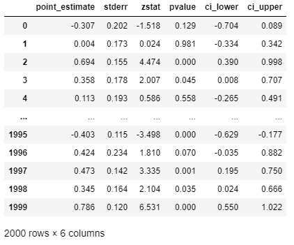
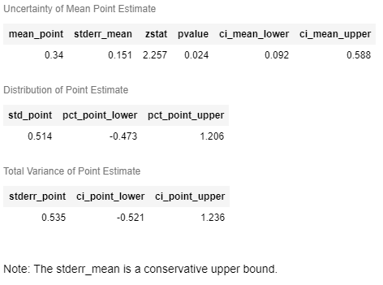
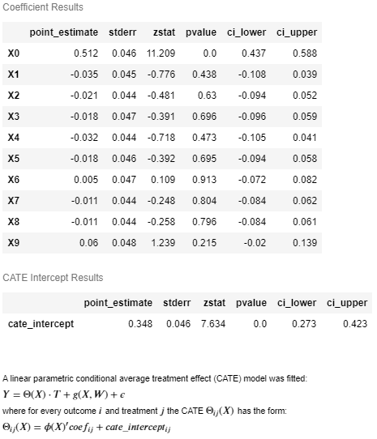
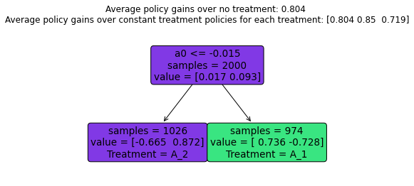

[](https://dev.azure.com/ms/EconML/_build/latest?definitionId=49&branchName=main)
[](https://pypi.org/project/econml/)
[](https://pypi.org/project/econml/)
[](https://pypi.org/project/econml/)


<h1> EconML: A Python Package for ML-Based Heterogeneous Treatment Effects Estimation</h1>

**EconML** is a Python package for estimating heterogeneous treatment effects from observational data via machine learning. This package was designed and built as part of the [ALICE project](https://www.microsoft.com/en-us/research/project/alice/) at Microsoft Research with the goal to combine state-of-the-art machine learning 
techniques with econometrics to bring automation to complex causal inference problems. The promise of EconML:

* Implement recent techniques in the literature at the intersection of econometrics and machine learning
* Maintain flexibility in modeling the effect heterogeneity (via techniques such as random forests, boosting, lasso and neural nets), while preserving the causal interpretation of the learned model and often offering valid confidence intervals
* Use a unified API
* Build on standard Python packages for Machine Learning and Data Analysis

One of the biggest promises of machine learning is to automate decision making in a multitude of domains. At the core of many data-driven personalized decision scenarios is the estimation of heterogeneous treatment effects: what is the causal effect of an intervention on an outcome of interest for a sample with a particular set of features? In a nutshell, this toolkit is designed to measure the causal effect of some treatment variable(s) `T` on an outcome 
variable `Y`, controlling for a set of features `X, W` and how does that effect vary as a function of `X`. The methods implemented are applicable even with observational (non-experimental or historical) datasets. For the estimation results to have a causal interpretation, some methods assume no unobserved confounders (i.e. there is no unobserved variable not included in `X, W` that simultaneously has an effect on both `T` and `Y`), while others assume access to an instrument `Z` (i.e. an observed variable `Z` that has an effect on the treatment `T` but no direct effect on the outcome `Y`). Most methods provide confidence intervals and inference results.

For detailed information about the package, consult the documentation at https://econml.azurewebsites.net/.

For information on use cases and background material on causal inference and heterogeneous treatment effects see our webpage at https://www.microsoft.com/en-us/research/project/econml/

<details>
<summary><strong><em>Table of Contents</em></strong></summary>

- [News](#news)
- [Getting Started](#getting-started)
  - [Installation](#installation)
  - [Usage Examples](#usage-examples)
    - [Estimation Methods](#estimation-methods)
    - [Interpretability](#interpretability)
    - [Causal Model Selection and Cross-Validation](#causal-model-selection-and-cross-validation)
    - [Inference](#inference)
    - [Policy Learning](#policy-learning)
- [For Developers](#for-developers)
  - [Running the tests](#running-the-tests)
  - [Generating the documentation](#generating-the-documentation)
- [Blogs and Publications](#blogs-and-publications)
- [Citation](#citation)
- [Contributing and Feedback](#contributing-and-feedback)
- [References](#references)

</details>

# News

**November 16, 2022:** Release v0.14.0, see release notes [here](https://github.com/py-why/EconML/releases/tag/v0.14.0)

<details><summary>Previous releases</summary>

**June 17, 2022:** Release v0.13.1, see release notes [here](https://github.com/py-why/EconML/releases/tag/v0.13.1)

**January 31, 2022:** Release v0.13.0, see release notes [here](https://github.com/py-why/EconML/releases/tag/v0.13.0)

**August 13, 2021:** Release v0.12.0, see release notes [here](https://github.com/py-why/EconML/releases/tag/v0.12.0)

**August 5, 2021:** Release v0.12.0b6, see release notes [here](https://github.com/py-why/EconML/releases/tag/v0.12.0b6)

**August 3, 2021:** Release v0.12.0b5, see release notes [here](https://github.com/py-why/EconML/releases/tag/v0.12.0b5)

**July 9, 2021:** Release v0.12.0b4, see release notes [here](https://github.com/py-why/EconML/releases/tag/v0.12.0b4)

**June 25, 2021:** Release v0.12.0b3, see release notes [here](https://github.com/py-why/EconML/releases/tag/v0.12.0b3)

**June 18, 2021:** Release v0.12.0b2, see release notes [here](https://github.com/py-why/EconML/releases/tag/v0.12.0b2)

**June 7, 2021:** Release v0.12.0b1, see release notes [here](https://github.com/py-why/EconML/releases/tag/v0.12.0b1)

**May 18, 2021:** Release v0.11.1, see release notes [here](https://github.com/py-why/EconML/releases/tag/v0.11.1)

**May 8, 2021:** Release v0.11.0, see release notes [here](https://github.com/py-why/EconML/releases/tag/v0.11.0)

**March 22, 2021:** Release v0.10.0, see release notes [here](https://github.com/py-why/EconML/releases/tag/v0.10.0)

**March 11, 2021:** Release v0.9.2, see release notes [here](https://github.com/py-why/EconML/releases/tag/v0.9.2)

**March 3, 2021:** Release v0.9.1, see release notes [here](https://github.com/py-why/EconML/releases/tag/v0.9.1)

**February 20, 2021:** Release v0.9.0, see release notes [here](https://github.com/py-why/EconML/releases/tag/v0.9.0)

**January 20, 2021:** Release v0.9.0b1, see release notes [here](https://github.com/py-why/EconML/releases/tag/v0.9.0b1)

**November 20, 2020:** Release v0.8.1, see release notes [here](https://github.com/py-why/EconML/releases/tag/v0.8.1)

**November 18, 2020:** Release v0.8.0, see release notes [here](https://github.com/py-why/EconML/releases/tag/v0.8.0)

**September 4, 2020:** Release v0.8.0b1, see release notes [here](https://github.com/py-why/EconML/releases/tag/v0.8.0b1)

**March 6, 2020:** Release v0.7.0, see release notes [here](https://github.com/py-why/EconML/releases/tag/v0.7.0)

**February 18, 2020:** Release v0.7.0b1, see release notes [here](https://github.com/py-why/EconML/releases/tag/v0.7.0b1)

**January 10, 2020:** Release v0.6.1, see release notes [here](https://github.com/py-why/EconML/releases/tag/v0.6.1)

**December 6, 2019:** Release v0.6, see release notes [here](https://github.com/py-why/EconML/releases/tag/v0.6)

**November 21, 2019:** Release v0.5, see release notes [here](https://github.com/py-why/EconML/releases/tag/v0.5). 

**June 3, 2019:** Release v0.4, see release notes [here](https://github.com/py-why/EconML/releases/tag/v0.4). 

**May 3, 2019:** Release v0.3, see release notes [here](https://github.com/py-why/EconML/releases/tag/v0.3).

**April 10, 2019:** Release v0.2, see release notes [here](https://github.com/py-why/EconML/releases/tag/v0.2).

**March 6, 2019:** Release v0.1, welcome to have a try and provide feedback.

</details>

# Getting Started

## Installation

Install the latest release from [PyPI](https://pypi.org/project/econml/):
```
pip install econml
```
To install from source, see [For Developers](#for-developers) section below.

## Usage Examples
### Estimation Methods

<details>
  <summary>Double Machine Learning (aka RLearner) (click to expand)</summary>

  * Linear final stage

  ```Python
  from econml.dml import LinearDML
  from sklearn.linear_model import LassoCV
  from econml.inference import BootstrapInference

  est = LinearDML(model_y=LassoCV(), model_t=LassoCV())
  ### Estimate with OLS confidence intervals
  est.fit(Y, T, X=X, W=W) # W -> high-dimensional confounders, X -> features
  treatment_effects = est.effect(X_test)
  lb, ub = est.effect_interval(X_test, alpha=0.05) # OLS confidence intervals

  ### Estimate with bootstrap confidence intervals
  est.fit(Y, T, X=X, W=W, inference='bootstrap')  # with default bootstrap parameters
  est.fit(Y, T, X=X, W=W, inference=BootstrapInference(n_bootstrap_samples=100))  # or customized
  lb, ub = est.effect_interval(X_test, alpha=0.05) # Bootstrap confidence intervals
  ```

  * Sparse linear final stage

  ```Python
  from econml.dml import SparseLinearDML
  from sklearn.linear_model import LassoCV

  est = SparseLinearDML(model_y=LassoCV(), model_t=LassoCV())
  est.fit(Y, T, X=X, W=W) # X -> high dimensional features
  treatment_effects = est.effect(X_test)
  lb, ub = est.effect_interval(X_test, alpha=0.05) # Confidence intervals via debiased lasso
  ```

  * Generic Machine Learning last stage
  
  ```Python
  from econml.dml import NonParamDML
  from sklearn.ensemble import RandomForestRegressor, RandomForestClassifier

  est = NonParamDML(model_y=RandomForestRegressor(),
                    model_t=RandomForestClassifier(),
                    model_final=RandomForestRegressor(),
                    discrete_treatment=True)
  est.fit(Y, T, X=X, W=W) 
  treatment_effects = est.effect(X_test)
  ```

</details>

<details>
  <summary>Dynamic Double Machine Learning (click to expand)</summary>

  ```Python
  from econml.panel.dml import DynamicDML
  # Use defaults
  est = DynamicDML()
  # Or specify hyperparameters
  est = DynamicDML(model_y=LassoCV(cv=3), 
                   model_t=LassoCV(cv=3), 
                   cv=3)
  est.fit(Y, T, X=X, W=None, groups=groups, inference="auto")
  # Effects
  treatment_effects = est.effect(X_test)
  # Confidence intervals
  lb, ub = est.effect_interval(X_test, alpha=0.05)
  ```
</details>

<details>
  <summary>Causal Forests (click to expand)</summary>

  ```Python
  from econml.dml import CausalForestDML
  from sklearn.linear_model import LassoCV
  # Use defaults
  est = CausalForestDML()
  # Or specify hyperparameters
  est = CausalForestDML(criterion='het', n_estimators=500,       
                        min_samples_leaf=10, 
                        max_depth=10, max_samples=0.5,
                        discrete_treatment=False,
                        model_t=LassoCV(), model_y=LassoCV())
  est.fit(Y, T, X=X, W=W)
  treatment_effects = est.effect(X_test)
  # Confidence intervals via Bootstrap-of-Little-Bags for forests
  lb, ub = est.effect_interval(X_test, alpha=0.05)
  ```
</details>


<details>
  <summary>Orthogonal Random Forests (click to expand)</summary>

  ```Python
  from econml.orf import DMLOrthoForest, DROrthoForest
  from econml.sklearn_extensions.linear_model import WeightedLasso, WeightedLassoCV
  # Use defaults
  est = DMLOrthoForest()
  est = DROrthoForest()
  # Or specify hyperparameters
  est = DMLOrthoForest(n_trees=500, min_leaf_size=10,
                       max_depth=10, subsample_ratio=0.7,
                       lambda_reg=0.01,
                       discrete_treatment=False,
                       model_T=WeightedLasso(alpha=0.01), model_Y=WeightedLasso(alpha=0.01),
                       model_T_final=WeightedLassoCV(cv=3), model_Y_final=WeightedLassoCV(cv=3))
  est.fit(Y, T, X=X, W=W)
  treatment_effects = est.effect(X_test)
  # Confidence intervals via Bootstrap-of-Little-Bags for forests
  lb, ub = est.effect_interval(X_test, alpha=0.05)
  ```
</details>

<details>

<summary>Meta-Learners (click to expand)</summary>
  
  * XLearner

  ```Python
  from econml.metalearners import XLearner
  from sklearn.ensemble import GradientBoostingClassifier, GradientBoostingRegressor

  est = XLearner(models=GradientBoostingRegressor(),
                propensity_model=GradientBoostingClassifier(),
                cate_models=GradientBoostingRegressor())
  est.fit(Y, T, X=np.hstack([X, W]))
  treatment_effects = est.effect(np.hstack([X_test, W_test]))

  # Fit with bootstrap confidence interval construction enabled
  est.fit(Y, T, X=np.hstack([X, W]), inference='bootstrap')
  treatment_effects = est.effect(np.hstack([X_test, W_test]))
  lb, ub = est.effect_interval(np.hstack([X_test, W_test]), alpha=0.05) # Bootstrap CIs
  ```
  
  * SLearner

  ```Python
  from econml.metalearners import SLearner
  from sklearn.ensemble import GradientBoostingRegressor

  est = SLearner(overall_model=GradientBoostingRegressor())
  est.fit(Y, T, X=np.hstack([X, W]))
  treatment_effects = est.effect(np.hstack([X_test, W_test]))
  ```

  * TLearner

  ```Python
  from econml.metalearners import TLearner
  from sklearn.ensemble import GradientBoostingRegressor

  est = TLearner(models=GradientBoostingRegressor())
  est.fit(Y, T, X=np.hstack([X, W]))
  treatment_effects = est.effect(np.hstack([X_test, W_test]))
  ```
</details>

<details>
<summary>Doubly Robust Learners (click to expand)
</summary>

* Linear final stage

```Python
from econml.dr import LinearDRLearner
from sklearn.ensemble import GradientBoostingRegressor, GradientBoostingClassifier

est = LinearDRLearner(model_propensity=GradientBoostingClassifier(),
                      model_regression=GradientBoostingRegressor())
est.fit(Y, T, X=X, W=W)
treatment_effects = est.effect(X_test)
lb, ub = est.effect_interval(X_test, alpha=0.05)
```

* Sparse linear final stage

```Python
from econml.dr import SparseLinearDRLearner
from sklearn.ensemble import GradientBoostingRegressor, GradientBoostingClassifier

est = SparseLinearDRLearner(model_propensity=GradientBoostingClassifier(),
                            model_regression=GradientBoostingRegressor())
est.fit(Y, T, X=X, W=W)
treatment_effects = est.effect(X_test)
lb, ub = est.effect_interval(X_test, alpha=0.05)
```

* Nonparametric final stage

```Python
from econml.dr import ForestDRLearner
from sklearn.ensemble import GradientBoostingRegressor, GradientBoostingClassifier

est = ForestDRLearner(model_propensity=GradientBoostingClassifier(),
                      model_regression=GradientBoostingRegressor())
est.fit(Y, T, X=X, W=W) 
treatment_effects = est.effect(X_test)
lb, ub = est.effect_interval(X_test, alpha=0.05)
```
</details>

<details>
<summary>Double Machine Learning with Instrumental Variables (click to expand)</summary>

* Orthogonal instrumental variable learner

```Python
from econml.iv.dml import OrthoIV

est = OrthoIV(projection=False, 
              discrete_treatment=True, 
              discrete_instrument=True)
est.fit(Y, T, Z=Z, X=X, W=W)
treatment_effects = est.effect(X_test)
lb, ub = est.effect_interval(X_test, alpha=0.05) # OLS confidence intervals
```
* Nonparametric double machine learning with instrumental variable

```Python
from econml.iv.dml import NonParamDMLIV

est = NonParamDMLIV(projection=False, 
                    discrete_treatment=True, 
                    discrete_instrument=True)
est.fit(Y, T, Z=Z, X=X, W=W) # no analytical confidence interval available
treatment_effects = est.effect(X_test)
```
</details>

<details>
<summary>Doubly Robust Machine Learning with Instrumental Variables (click to expand)</summary>

* Linear final stage
```Python
from econml.iv.dr import LinearDRIV

est = LinearDRIV(discrete_instrument=True, discrete_treatment=True)
est.fit(Y, T, Z=Z, X=X, W=W)
treatment_effects = est.effect(X_test)
lb, ub = est.effect_interval(X_test, alpha=0.05) # OLS confidence intervals
```

* Sparse linear final stage

```Python
from econml.iv.dr import SparseLinearDRIV

est = SparseLinearDRIV(discrete_instrument=True, discrete_treatment=True)
est.fit(Y, T, Z=Z, X=X, W=W)
treatment_effects = est.effect(X_test)
lb, ub = est.effect_interval(X_test, alpha=0.05) # Debiased lasso confidence intervals
```

* Nonparametric final stage
```Python
from econml.iv.dr import ForestDRIV

est = ForestDRIV(discrete_instrument=True, discrete_treatment=True)
est.fit(Y, T, Z=Z, X=X, W=W)
treatment_effects = est.effect(X_test)
# Confidence intervals via Bootstrap-of-Little-Bags for forests
lb, ub = est.effect_interval(X_test, alpha=0.05) 
```

* Linear intent-to-treat (discrete instrument, discrete treatment)

```Python
from econml.iv.dr import LinearIntentToTreatDRIV
from sklearn.ensemble import GradientBoostingRegressor, GradientBoostingClassifier

est = LinearIntentToTreatDRIV(model_y_xw=GradientBoostingRegressor(),
                              model_t_xwz=GradientBoostingClassifier(),
                              flexible_model_effect=GradientBoostingRegressor())
est.fit(Y, T, Z=Z, X=X, W=W)
treatment_effects = est.effect(X_test)
lb, ub = est.effect_interval(X_test, alpha=0.05) # OLS confidence intervals
```
</details>

<details>
<summary>Deep Instrumental Variables (click to expand)</summary>

```Python
import keras
from econml.iv.nnet import DeepIV

treatment_model = keras.Sequential([keras.layers.Dense(128, activation='relu', input_shape=(2,)),
                                    keras.layers.Dropout(0.17),
                                    keras.layers.Dense(64, activation='relu'),
                                    keras.layers.Dropout(0.17),
                                    keras.layers.Dense(32, activation='relu'),
                                    keras.layers.Dropout(0.17)])
response_model = keras.Sequential([keras.layers.Dense(128, activation='relu', input_shape=(2,)),
                                  keras.layers.Dropout(0.17),
                                  keras.layers.Dense(64, activation='relu'),
                                  keras.layers.Dropout(0.17),
                                  keras.layers.Dense(32, activation='relu'),
                                  keras.layers.Dropout(0.17),
                                  keras.layers.Dense(1)])
est = DeepIV(n_components=10, # Number of gaussians in the mixture density networks)
             m=lambda z, x: treatment_model(keras.layers.concatenate([z, x])), # Treatment model
             h=lambda t, x: response_model(keras.layers.concatenate([t, x])), # Response model
             n_samples=1 # Number of samples used to estimate the response
             )
est.fit(Y, T, X=X, Z=Z) # Z -> instrumental variables
treatment_effects = est.effect(X_test)
```
</details>

See the <a href="#references">References</a> section for more details.

### Interpretability
<details>
  <summary>Tree Interpreter of the CATE model (click to expand)</summary>
  
  ```Python
  from econml.cate_interpreter import SingleTreeCateInterpreter
  intrp = SingleTreeCateInterpreter(include_model_uncertainty=True, max_depth=2, min_samples_leaf=10)
  # We interpret the CATE model's behavior based on the features used for heterogeneity
  intrp.interpret(est, X)
  # Plot the tree
  plt.figure(figsize=(25, 5))
  intrp.plot(feature_names=['A', 'B', 'C', 'D'], fontsize=12)
  plt.show()
  ```
  
  
</details>

<details>
  <summary>Policy Interpreter of the CATE model (click to expand)</summary>

  ```Python
  from econml.cate_interpreter import SingleTreePolicyInterpreter
  # We find a tree-based treatment policy based on the CATE model
  intrp = SingleTreePolicyInterpreter(risk_level=0.05, max_depth=2, min_samples_leaf=1,min_impurity_decrease=.001)
  intrp.interpret(est, X, sample_treatment_costs=0.2)
  # Plot the tree
  plt.figure(figsize=(25, 5))
  intrp.plot(feature_names=['A', 'B', 'C', 'D'], fontsize=12)
  plt.show()
  ```
  

</details>

<details>
  <summary>SHAP values for the CATE model (click to expand)</summary>

  ```Python
  import shap
  from econml.dml import CausalForestDML
  est = CausalForestDML()
  est.fit(Y, T, X=X, W=W)
  shap_values = est.shap_values(X)
  shap.summary_plot(shap_values['Y0']['T0'])
  ```

</details>


### Causal Model Selection and Cross-Validation


<details>
  <summary>Causal model selection with the `RScorer` (click to expand)</summary>

  ```Python
  from econml.score import RScorer

  # split data in train-validation
  X_train, X_val, T_train, T_val, Y_train, Y_val = train_test_split(X, T, y, test_size=.4)

  # define list of CATE estimators to select among
  reg = lambda: RandomForestRegressor(min_samples_leaf=20)
  clf = lambda: RandomForestClassifier(min_samples_leaf=20)
  models = [('ldml', LinearDML(model_y=reg(), model_t=clf(), discrete_treatment=True,
                               linear_first_stages=False, cv=3)),
            ('xlearner', XLearner(models=reg(), cate_models=reg(), propensity_model=clf())),
            ('dalearner', DomainAdaptationLearner(models=reg(), final_models=reg(), propensity_model=clf())),
            ('slearner', SLearner(overall_model=reg())),
            ('drlearner', DRLearner(model_propensity=clf(), model_regression=reg(),
                                    model_final=reg(), cv=3)),
            ('rlearner', NonParamDML(model_y=reg(), model_t=clf(), model_final=reg(),
                                     discrete_treatment=True, cv=3)),
            ('dml3dlasso', DML(model_y=reg(), model_t=clf(),
                               model_final=LassoCV(cv=3, fit_intercept=False),
                               discrete_treatment=True,
                               featurizer=PolynomialFeatures(degree=3),
                               linear_first_stages=False, cv=3))
  ]

  # fit cate models on train data
  models = [(name, mdl.fit(Y_train, T_train, X=X_train)) for name, mdl in models]

  # score cate models on validation data
  scorer = RScorer(model_y=reg(), model_t=clf(),
                   discrete_treatment=True, cv=3, mc_iters=2, mc_agg='median')
  scorer.fit(Y_val, T_val, X=X_val)
  rscore = [scorer.score(mdl) for _, mdl in models]
  # select the best model
  mdl, _ = scorer.best_model([mdl for _, mdl in models])
  # create weighted ensemble model based on score performance
  mdl, _ = scorer.ensemble([mdl for _, mdl in models])
  ```

</details>

<details>
  <summary>First Stage Model Selection (click to expand)</summary>

First stage models can be selected either by passing in cross-validated models (e.g. `sklearn.linear_model.LassoCV`) to EconML's estimators or perform the first stage model selection outside of EconML and pass in the selected model. Unless selecting among a large set of hyperparameters, choosing first stage models externally is the preferred method due to statistical and computational advantages.

```Python
from econml.dml import LinearDML
from sklearn import clone
from sklearn.ensemble import RandomForestRegressor
from sklearn.model_selection import GridSearchCV

cv_model = GridSearchCV(
              estimator=RandomForestRegressor(),
              param_grid={
                  "max_depth": [3, None],
                  "n_estimators": (10, 30, 50, 100, 200),
                  "max_features": (2, 4, 6),
              },
              cv=5,
           )
# First stage model selection within EconML
# This is more direct, but computationally and statistically less efficient
est = LinearDML(model_y=cv_model, model_t=cv_model)
# First stage model selection ouside of EconML
# This is the most efficient, but requires boilerplate code
model_t = clone(cv_model).fit(W, T).best_estimator_
model_y = clone(cv_model).fit(W, Y).best_estimator_
est = LinearDML(model_y=model_t, model_t=model_y)
```


</details>

### Inference

Whenever inference is enabled, then one can get a more structure `InferenceResults` object with more elaborate inference information, such
as p-values and z-statistics. When the CATE model is linear and parametric, then a `summary()` method is also enabled. For instance:

  ```Python
  from econml.dml import LinearDML
  # Use defaults
  est = LinearDML()
  est.fit(Y, T, X=X, W=W)
  # Get the effect inference summary, which includes the standard error, z test score, p value, and confidence interval given each sample X[i]
  est.effect_inference(X_test).summary_frame(alpha=0.05, value=0, decimals=3)
  # Get the population summary for the entire sample X
  est.effect_inference(X_test).population_summary(alpha=0.1, value=0, decimals=3, tol=0.001)
  #  Get the parameter inference summary for the final model
  est.summary()
  ```
  
  <details><summary>Example Output (click to expand)</summary>
  
  ```Python
  # Get the effect inference summary, which includes the standard error, z test score, p value, and confidence interval given each sample X[i]
  est.effect_inference(X_test).summary_frame(alpha=0.05, value=0, decimals=3)
  ```
  
  
  ```Python
  # Get the population summary for the entire sample X
  est.effect_inference(X_test).population_summary(alpha=0.1, value=0, decimals=3, tol=0.001)
  ```
  
  
  ```Python
  #  Get the parameter inference summary for the final model
  est.summary()
  ```
  
  
  </details>
  

### Policy Learning

You can also perform direct policy learning from observational data, using the doubly robust method for offline
policy learning. These methods directly predict a recommended treatment, without internally fitting an explicit
model of the conditional average treatment effect.

<details>
  <summary>Doubly Robust Policy Learning (click to expand)</summary>

```Python
from econml.policy import DRPolicyTree, DRPolicyForest
from sklearn.ensemble import RandomForestRegressor

# fit a single binary decision tree policy
policy = DRPolicyTree(max_depth=1, min_impurity_decrease=0.01, honest=True)
policy.fit(y, T, X=X, W=W)
# predict the recommended treatment
recommended_T = policy.predict(X)
# plot the binary decision tree
plt.figure(figsize=(10,5))
policy.plot()
# get feature importances
importances = policy.feature_importances_

# fit a binary decision forest
policy = DRPolicyForest(max_depth=1, min_impurity_decrease=0.01, honest=True)
policy.fit(y, T, X=X, W=W)
# predict the recommended treatment
recommended_T = policy.predict(X)
# plot the first tree in the ensemble
plt.figure(figsize=(10,5))
policy.plot(0)
# get feature importances
importances = policy.feature_importances_
```


  
</details>

To see more complex examples, go to the [notebooks](https://github.com/py-why/EconML/tree/main/notebooks) section of the repository. For a more detailed description of the treatment effect estimation algorithms, see the EconML [documentation](https://econml.azurewebsites.net/).

# For Developers

You can get started by cloning this repository. We use 
[setuptools](https://setuptools.readthedocs.io/en/latest/index.html) for building and distributing our package.
We rely on some recent features of setuptools, so make sure to upgrade to a recent version with
`pip install setuptools --upgrade`.  Then from your local copy of the repository you can run `pip install -e .` to get started (but depending on what you're doing you might want to install with extras instead, like `pip install -e .[plt]` if you want to use matplotlib integration, or you can use  `pip install -e .[all]` to include all extras).

## Running the tests

This project uses [pytest](https://docs.pytest.org/) for testing.  To run tests locally after installing the package, you can use `pip install pytest-runner` followed by `python setup.py pytest`.

We have added pytest marks to some tests to make it easier to run a subset, and you can set the PYTEST_ADDOPTS environment variable to take advantage of this.  For instance, you can set it to `-m "not (notebook or automl)"` to skip notebook and automl tests that have some additional dependencies. 

## Generating the documentation

This project's documentation is generated via [Sphinx](https://www.sphinx-doc.org/en/main/index.html).  Note that we use [graphviz](https://graphviz.org/)'s 
`dot` application to produce some of the images in our documentation, so you should make sure that `dot` is installed and in your path.

To generate a local copy of the documentation from a clone of this repository, just run `python setup.py build_sphinx -W -E -a`, which will build the documentation and place it under the `build/sphinx/html` path. 

The reStructuredText files that make up the documentation are stored in the [docs directory](https://github.com/py-why/EconML/tree/main/doc); module documentation is automatically generated by the Sphinx build process.

## Release process

We use GitHub Actions to build and publish the package and documentation.  To create a new release, an admin should perform the following steps:

1. Update the version number in `econml/_version.py` and add a mention of the new version in the news section of this file and commit the changes.
2. Manually run the publish_package.yml workflow to build and publish the package to PyPI.
3. Manually run the publish_docs.yml workflow to build and publish the documentation.
4. Under https://github.com/py-why/EconML/releases, create a new release with a corresponding tag, and update the release notes.

# Blogs and Publications

* June 2019: [Treatment Effects with Instruments paper](https://arxiv.org/pdf/1905.10176.pdf)

* May 2019: [Open Data Science Conference Workshop](https://odsc.com/speakers/machine-learning-estimation-of-heterogeneous-treatment-effect-the-microsoft-econml-library/) 

* 2018: [Orthogonal Random Forests paper](http://proceedings.mlr.press/v97/oprescu19a.html)

* 2017: [DeepIV paper](http://proceedings.mlr.press/v70/hartford17a/hartford17a.pdf)

# Citation

If you use EconML in your research, please cite us as follows:

   Keith Battocchi, Eleanor Dillon, Maggie Hei, Greg Lewis, Paul Oka, Miruna Oprescu, Vasilis Syrgkanis. **EconML: A Python Package for ML-Based Heterogeneous Treatment Effects Estimation.** https://github.com/py-why/EconML, 2019. Version 0.x.

BibTex:

```
@misc{econml,
  author={Keith Battocchi, Eleanor Dillon, Maggie Hei, Greg Lewis, Paul Oka, Miruna Oprescu, Vasilis Syrgkanis},
  title={{EconML}: {A Python Package for ML-Based Heterogeneous Treatment Effects Estimation}},
  howpublished={https://github.com/py-why/EconML},
  note={Version 0.x},
  year={2019}
}
```

# Contributing and Feedback

This project welcomes contributions and suggestions.  We use the [DCO bot](https://github.com/apps/dco) to enforce a [Developer Certificate of Origin](https://developercertificate.org/) which requires users to sign-off on their commits.  This is a simple way to certify that you wrote or otherwise have the right to submit the code you are contributing to the project.  Git provides a `-s` command line option to include this automatically when you commit via `git commit`.

When you submit a pull request, a CLA-bot will automatically determine whether you need to provide
a CLA and decorate the PR appropriately (e.g., label, comment). Simply follow the instructions
provided by the bot. You will only need to do this once across all repos using our CLA.

This project has adopted the [PyWhy Code of Conduct](https://github.com/py-why/governance/blob/main/CODE-OF-CONDUCT.md).

# References

Athey, Susan, and Stefan Wager.
**Policy learning with observational data.**
[*Econometrica 89.1, 133-161*](https://doi.org/10.3982/ECTA15732), 2021.

X Nie, S Wager.
**Quasi-Oracle Estimation of Heterogeneous Treatment Effects.**
[*Biometrika 108.2, 299-319*](https://doi.org/10.1093/biomet/asaa076), 2021.

V. Syrgkanis, V. Lei, M. Oprescu, M. Hei, K. Battocchi, G. Lewis.
**Machine Learning Estimation of Heterogeneous Treatment Effects with Instruments.**
[*Proceedings of the 33rd Conference on Neural Information Processing Systems (NeurIPS)*](https://arxiv.org/abs/1905.10176), 2019.
**(Spotlight Presentation)**

D. Foster, V. Syrgkanis.
**Orthogonal Statistical Learning.**
[*Proceedings of the 32nd Annual Conference on Learning Theory (COLT)*](https://arxiv.org/pdf/1901.09036.pdf), 2019.
**(Best Paper Award)**

M. Oprescu, V. Syrgkanis and Z. S. Wu.
**Orthogonal Random Forest for Causal Inference.**
[*Proceedings of the 36th International Conference on Machine Learning (ICML)*](http://proceedings.mlr.press/v97/oprescu19a.html), 2019.

S. Künzel, J. Sekhon, J. Bickel and B. Yu.
**Metalearners for estimating heterogeneous treatment effects using machine learning.**
[*Proceedings of the national academy of sciences, 116(10), 4156-4165*](https://www.pnas.org/content/116/10/4156), 2019.

S. Athey, J. Tibshirani, S. Wager.
**Generalized random forests.**
[*Annals of Statistics, 47, no. 2, 1148--1178*](https://projecteuclid.org/euclid.aos/1547197251), 2019.

V. Chernozhukov, D. Nekipelov, V. Semenova, V. Syrgkanis.
**Plug-in Regularized Estimation of High-Dimensional Parameters in Nonlinear Semiparametric Models.**
[*Arxiv preprint arxiv:1806.04823*](https://arxiv.org/abs/1806.04823), 2018.

S. Wager, S. Athey.
**Estimation and Inference of Heterogeneous Treatment Effects using Random Forests.**
[*Journal of the American Statistical Association, 113:523, 1228-1242*](https://www.tandfonline.com/doi/citedby/10.1080/01621459.2017.1319839), 2018.

Jason Hartford, Greg Lewis, Kevin Leyton-Brown, and Matt Taddy. **Deep IV: A flexible approach for counterfactual prediction.** [*Proceedings of the 34th International Conference on Machine Learning, ICML'17*](http://proceedings.mlr.press/v70/hartford17a/hartford17a.pdf), 2017.

V. Chernozhukov, D. Chetverikov, M. Demirer, E. Duflo, C. Hansen, and a. W. Newey. **Double Machine Learning for Treatment and Causal Parameters.** [*ArXiv preprint arXiv:1608.00060*](https://arxiv.org/abs/1608.00060), 2016.

Dudik, M., Erhan, D., Langford, J., & Li, L.
**Doubly robust policy evaluation and optimization.**
[*Statistical Science, 29(4), 485-511*](https://projecteuclid.org/journals/statistical-science/volume-29/issue-4/Doubly-Robust-Policy-Evaluation-and-Optimization/10.1214/14-STS500.full), 2014.
